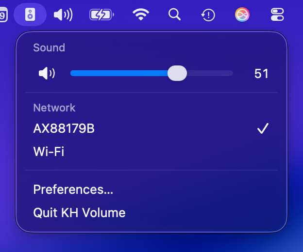

# KH Volume

**KH Volume** is a macOS menu bar application designed to control the volume of **Neumann KH DSP** studio monitors. It is especially useful when your speakers are connected via **S/PDIF coaxial digital input** or USB, where the standard macOS volume keys no longer map to your monitors.

Instead of adjusting the system volume slider, KH Volume directly drives the **network DSP level** of your speakers using Sennheiser Sound Control (SSC) over IPv6. This provides a practical and precise way to change the listening level and toggle mute directly from your Mac's menu bar.

**Thanks to [Thorsten Schwinn](https://github.com/schwinn)** and the contributors of [**khtool**](https://github.com/schwinn/khtool) — the open-source Python tool that communicates with Georg Neumann KH speakers over SSC. KH Volume is a native macOS shell around a bundled `khvol` helper that builds on vendored khtool (MIT). Without that project, this app would not exist.



## Supported Monitors

If your KH monitors are connected to your local network via Ethernet (built-in port or adapter) and support SSC, KH Volume can seamlessly manage their levels. This includes popular models across the Neumann KH DSP lineup: **KH 80 DSP**, **KH 120 II**, **KH 150**, **KH 150 AES67**, and **KH 750 DSP**.

## How it works

1. Your Mac and the speakers share a network connection (usually Ethernet to the speaker’s RJ45 port).
2. KH Volume runs a bundled **`khvol`** helper (Python + [khtool](KhVolume/Helper/vendor/)) to send SSC commands over the LAN.
3. The app displays the current DSP level in the menu bar, featuring a popover similar to the native macOS Sound interface.
4. Optional global shortcuts (default **⌥=** / **⌥-**) allow you to adjust the level without opening the popover.

**Important:** The control mechanism operates entirely over the network control plane, independent of the audio bitstream. This means your Mac can output pristine audio via a digital S/PDIF connection while the volume level is managed separately over Ethernet via SSC.

## Features

- Menu bar level display and slider for quick access
- Mute toggle functionality
- Network interface picker (supports USB Ethernet adapters, built-in LAN, etc.)
- Per-app volume cap (“volume limit”) and customizable step sizes (1 / 3 / 6 dB)
- Global keyboard shortcuts (customizable in Sound Settings)
- Open at Login support (requires a signed app in `/Applications`)
- Left/right level mismatch warning for stereo pairs

## Requirements

- **macOS 14** or later
- Neumann KH DSP monitors reachable on your LAN via SSC (IPv6 link-local)
- A Mac network interface capable of reaching the speakers (e.g., USB–Ethernet adapter, `en15`, `en0`)
- To **build from source:** Xcode Command Line Tools / Swift 5.9+, Python 3.12+ (for the bundled helper only)

## Install (release)

Pre-built signed releases may be published separately. To build locally:

```bash
./scripts/build-khvol-helper.sh
./scripts/build-app-bundle.sh
open "dist/KH Volume.app"
```

For distribution signing and notarization, see `scripts/sign-app.sh`.

## Development

```bash
# Build PyInstaller helper (first time or after KhVolume/Helper/ changes)
./scripts/build-khvol-helper.sh

# Run the app
cd KhVolume && swift run

# Optional: run helper CLI from source
./KhVolume/Scripts/khvol-dev interfaces
./KhVolume/Scripts/khvol-dev scan --config-dir ~/.khvol-test -i en15
```

App data and scan cache: `~/Library/Application Support/KHVolume/`

Smoke test (hardware or offline-tolerant):

```bash
export KHVOL_INTERFACE=en15   # your USB-LAN interface name
./scripts/smoke-test.sh
```

## Troubleshooting

| Symptom | Things to check |
|--------|------------------|
| Menu bar shows `!` | Speaker off, wrong network interface, or no route to the speaker |
| No speakers in **Network** list | Cable/link down; pick the interface that has link (`ifconfig`) |
| Level does not change | Confirm `--scan` finds devices; try the interface where `khtool` works |
| **Open at Login** fails | Install a **Developer ID–signed** `KH Volume.app` in `/Applications` |
| Left/right levels differ | Use decrease-only until matched, or enable “allow increase when mismatched” in settings |

## Project layout

```
KhVolume/              Swift menu bar app (Swift Package Manager)
  Sources/             App UI and logic
  Helper/              khvol CLI + vendor/khtool (bundled into the app)
  Scripts/             khvol-dev — run CLI from source without PyInstaller
scripts/               build-app-bundle.sh, sign-app.sh, smoke-test.sh
```

## Credits

- Speaker control protocol: **SSC** (Sennheiser Sound Control), used by **Georg Neumann GmbH** KH DSP products.
- Low-level tool: [khtool](https://github.com/schwinn/khtool) by **Thorsten Schwinn** et al. (vendored under `KhVolume/Helper/vendor/`).
- App: native SwiftUI menu bar shell around the bundled `khvol` helper.

## License

KH Volume is released under the [MIT License](LICENSE). See [NOTICES](NOTICES) for bundled third-party components (including [khtool](https://github.com/schwinn/khtool) and [pyssc](https://github.com/schwinn/pyssc)).

This project is **not affiliated with** Georg Neumann GmbH, Sennheiser, or Neumann. Neumann product names are trademarks of their respective owners. Use of SSC to control your hardware is at your own risk.
